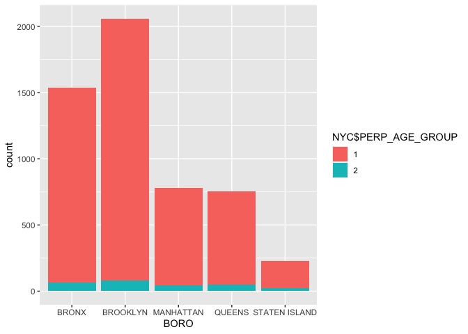
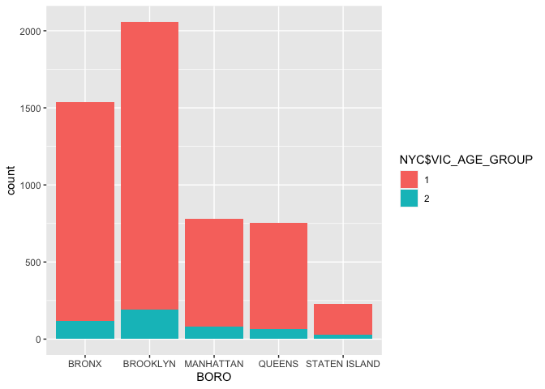
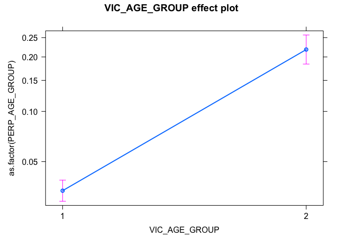

NYC Report
================
N.L
10/14/2021

``` r
##Load the data set in and 
##then null all the categories that 
##I was not interested in using in my analysis. 
##This included the precinct, statistical murder flag,
##jurisdiction code, incident key, 
##Lon_Lat, X coordinate, Y coordinate, Latitude, and Longitude. 
##I then changed all the unknown variables in the categories to NA and then I omitted them 
##so I would have a clean data set that had no unknown variables as 
##I wanted to deal with known ones to have the most accurate data/analysis. 
##I also turned all the blank areas in the data frame 
##into NA and omitted them as well for the reason stated above. 
##SCROLL TO PAGE 299 TO PASS THE CLEANED DATA FRAME
url_in = "https://data.cityofnewyork.us/api/views/833y-fsy8/rows.csv?accessType=DOWNLOAD"
NYC <- read.csv(file = "https://data.cityofnewyork.us/api/views/833y-fsy8/rows.csv?accessType=DOWNLOAD")
NYC$PRECINCT <-NULL
NYC$STATISTICAL_MURDER_FLAG<-NULL
NYC$JURISDICTION_CODE <- NULL
NYC$INCIDENT_KEY <-NULL
NYC$STATISTICAL_MURDER_FLAG <-NULL
NYC$Lon_Lat <-NULL
NYC$X_COORD_CD <- NULL
NYC$Y_COORD_CD <-NULL
NYC$Latitude <-NULL
NYC$Longitude <-NULL
NYC[NYC=="UNKNOWN"] <- NA
NYC <- na.omit(NYC)
NYC[NYC==""] <- NA
NYC <- na.omit(NYC)
```

``` r
## Change the age groups into binary to do logistic reg and to plot easier 
NYC$PERP_AGE_GROUP[NYC$PERP_AGE_GROUP<=44]<-1
NYC$PERP_AGE_GROUP[NYC$PERP_AGE_GROUP >= 45] <-2
NYC$VIC_AGE_GROUP[NYC$VIC_AGE_GROUP <=44] <- 1
NYC$VIC_AGE_GROUP[NYC$VIC_AGE_GROUP >=45] <- 2
```

``` r
##Create a stacked bar graph to compare the age of the perpetrators by age group to borough
library(ggplot2)
ggplot(NYC, 
       aes(x = BORO, 
           fill = NYC$PERP_AGE_GROUP)) +
    geom_bar(position = "stack")
```

<!-- -->

``` r
##Create a stacked bar graph to compare the age of victims by age group by borough
ggplot(NYC, 
      aes(x = BORO, 
           fill = NYC$VIC_AGE_GROUP)) + 
   geom_bar(position = "stack")
```

<!-- -->

``` r
 #install.packages (" effects", repos =" http://cran.us.r-project.org ") 
#To install package write install.packages("effects") in the console and then library(effects) to activate it. Reknit the file afterward. 
library(effects)
```

    ## Loading required package: carData

    ## lattice theme set by effectsTheme()
    ## See ?effectsTheme for details.

``` r
##Create the glm function and look at summary to see the P value 
glm(as.factor(NYC$PERP_AGE_GROUP)~ NYC$VIC_AGE_GROUP, data = NYC, family = binomial)
```

    ## 
    ## Call:  glm(formula = as.factor(NYC$PERP_AGE_GROUP) ~ NYC$VIC_AGE_GROUP, 
    ##     family = binomial, data = NYC)
    ## 
    ## Coefficients:
    ##        (Intercept)  NYC$VIC_AGE_GROUP2  
    ##             -3.378               2.102  
    ## 
    ## Degrees of Freedom: 5358 Total (i.e. Null);  5357 Residual
    ## Null Deviance:       2116 
    ## Residual Deviance: 1920  AIC: 1924

``` r
##Name variable as A
A<-glm(as.factor(NYC$PERP_AGE_GROUP)~ NYC$VIC_AGE_GROUP, data = NYC, family = binomial)
summary(A)
```

    ## 
    ## Call:
    ## glm(formula = as.factor(NYC$PERP_AGE_GROUP) ~ NYC$VIC_AGE_GROUP, 
    ##     family = binomial, data = NYC)
    ## 
    ## Deviance Residuals: 
    ##     Min       1Q   Median       3Q      Max  
    ## -0.7018  -0.2591  -0.2591  -0.2591   2.6119  
    ## 
    ## Coefficients:
    ##                    Estimate Std. Error z value Pr(>|z|)    
    ## (Intercept)        -3.37752    0.08014  -42.14   <2e-16 ***
    ## NYC$VIC_AGE_GROUP2  2.10190    0.13641   15.41   <2e-16 ***
    ## ---
    ## Signif. codes:  0 '***' 0.001 '**' 0.01 '*' 0.05 '.' 0.1 ' ' 1
    ## 
    ## (Dispersion parameter for binomial family taken to be 1)
    ## 
    ##     Null deviance: 2116.2  on 5358  degrees of freedom
    ## Residual deviance: 1919.8  on 5357  degrees of freedom
    ## AIC: 1923.8
    ## 
    ## Number of Fisher Scoring iterations: 6

``` r
##Rewrite the glm function without the '$' sign to be able to plot the logistic regression with effects and rename it 'AF'
AF<- glm(as.factor(PERP_AGE_GROUP)~ VIC_AGE_GROUP,data= NYC,family =binomial)
plot(allEffects(AF))
```

<!-- -->

``` r
##ANALYSIS: There were many relationships that I could have looked at with this data set. 
##I decided to create groups (1 and 2) that correlated 
##with the age range of the victim 
##and the age range of the perpetrator. 
##Group 1 represented those 
##who were 44 years old and younger, while group 2 represented 45 and above.
##I did make two stacked bar graphs. 
##One was comparing  the perpetrator age group 
##to the borough he or she shot the victim in. 
##The other stacked bar graph was
##comparing the victim age group 
##to the borough that the shooting took place in. 
##Both of the graphs showed that people under 45 years of age
##were the primary victims and the primary perpetrators in New York City. 
##After making these graphs and looking at the data set a bit more, 
##I realized that I wanted to see if the victim's age group
##could predict the age group of the perpetrator. 
##What I found through doing a logistic regression and 
##plotting of the logistic regression 
##is that when a victim is 44 and younger, the probability of predicting 
##the age group of the perpetrator is roughly 2%, with a range of 0% to 4%.  However, in group 2,
##the probability of the victim age predicting the perpetrator age group goes up quite a bit. 
##If a victim is 45 and above 
##a person can expect the victim's age group to predict 
##perpetrator's age group about 20% of the time with a range of 18% to 25%. 
##Though the percentages are not high in either group, there is
##a slight difference in the ability to predict the perpetrator's age group
##from the victim's age group when a person is 45 years and above 
##than when a person is 44 years and younger. 
##This difference may represent a slight correlation between
##the victim's age and the perpetrator's age 
##when a person is 45 and above. 


###BIAS: There are a few biases that can come into play with this data set. 
##For one, the person that gathered the data 
##could have been biased to who they added to the data set. 
##They could have focused on people who were 45 and older,
##which skewed the data and thus formed a  slight correlation that was not ever there. 
##Another bias is that my decision to group two age groups
##together created a relationship that wasn't there. 
##Another potential bias is using data with a sizeable Residual deviance 
##and large AIC, making an inaccurate model. 
```
